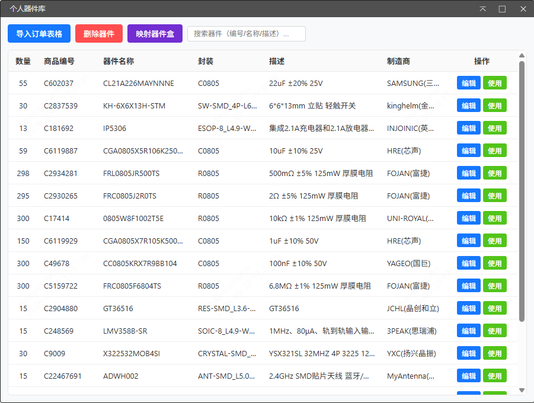
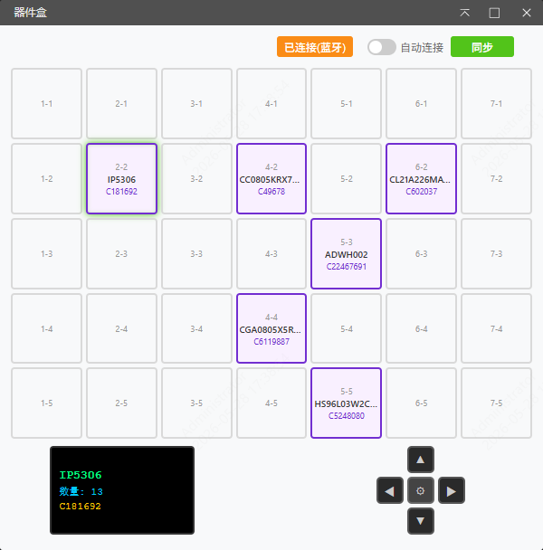
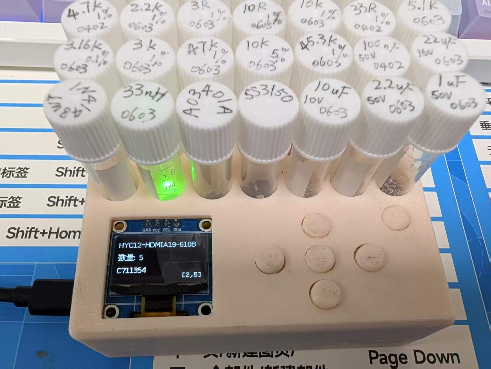

[简体中文](./README.md) | [English](#)

# EDA Smart Component Box

Based on LCSC Dev Board ESP32S3R8N8, working in conjunction with LCSC EDA Extension

**This extension is only supported in the browser environment and is not currently available for client-side use**

## Features

#### LCSC Order Import
- Support importing `.xls` / `.xlsx` order files from LCSC
- Automatically parse product codes (C-part numbers) and purchase quantities
- Batch query component names, packages, descriptions, manufacturers and other details
- Support incremental import, automatically merge duplicate components and accumulate quantities

#### Search & Filter
- Fuzzy search by component name, C-part number, or description
- Real-time filtering, results update as you type for quick component lookup
- Edit component information, modify quantities and notes
- Batch delete with select all / invert selection support

#### 5x7 Grid Layout
- Software interface simulates the physical component box **5 rows x 7 columns** layout
- Each slot can map to one component, displaying component name and quantity
- Double-click a slot to open the component selector, choose from the component library
- Support clearing mappings to free slots for other components

| Component Library | Component Box Configuration |
| --- | --- |
|  |  |

### Component Box

[Hardware Documentation](Hardware/Hardware_README.md)
[LCSC Open Source Hardware Hub](https://oshwhub.com/course-examples/project_kjqfbdaj)

#### Real-time Hardware Sync
- Connect hardware via USB serial or Bluetooth BLE
- Bidirectional real-time sync of component data between software and hardware
- Hardware button actions (pick parts) automatically sync to software for inventory deduction
- Auto-connect support, sync starts as soon as device comes online

### EDA Integration

- **Schematic Integration**: Access the component library directly from the schematic editor via the "Personal Component Library" menu, select a component and place it on the schematic with one click, automatically filling in component properties and LCSC part numbers
- **PCB Integration**: Similarly supports component library access in the PCB editor, place component footprints onto the PCB layout while maintaining synchronization with the schematic
- **Component Lookup**: Select a component in the schematic or PCB, execute the "Find Selected Component" command to automatically locate the corresponding position in the component library or component box
